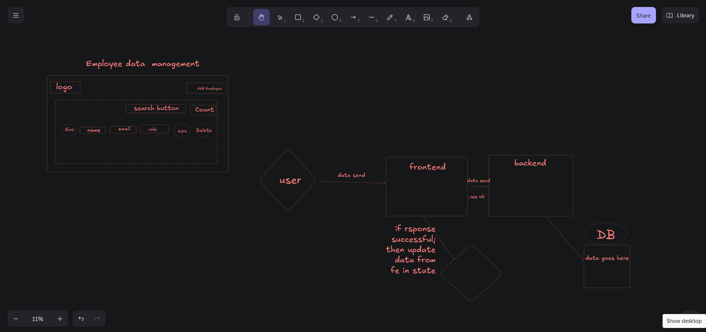

# Brief Intro Of Project - Employee Data Management 

This project is a web-based Employee Management System that provides an interface to manage organizational employee records. The application includes a navigation bar for easy access, an Add Employee functionality to insert new records, and a real-time search feature to quickly find employees. It also displays the total count of employees and maintains a dynamic list showing employee details such as name, email, and position. Each record comes with edit and delete options to update or remove employees efficiently.


## 🔗 Links
[](https://farooq-ten.vercel.app)

( https://verto-assingment-frontend.vercel.app ) Live Website


## Features

- Light/Dark Mode
- Add Employee
- Real-Time Search
- Employee Count
- Employee Listing
- Edit Employee
- Delete Employee
## Installation

Install my-project with bun


```bash
git clone https://github.com/Farooq722/verto-assingment
cd verto-assingment
```
At root level of repo
```bash
bun install
```
Setup .env file in Frontend & Backend
```bash
Frontend: 
VITE_BACKEND_URI=<yourbackendurl>

Backend: 
PORT=<portnumber>
DATABASE_URL=<yourbackendurl>
FRONTEND_URL=<yourfrontendurl>
```
For DB, run this docker command for local or use neom.com (make sure docker is running in your device)
```bash
docker run --name postgres-db \
-e POSTGRES_USER=myuser \
-e POSTGRES_PASSWORD=mypassword \
-e POSTGRES_DB=mydatabase \
-p 5432:5432 \
-d postgres
```
Option - 1: 

After setting up DB, we have to migrate db and generate client to use so (this works at root level of repo & here both FE & BE runs)

```bash
bun run build 
bun dev
```
Option - 2

After settingup DB, we have migrate db and generate client to use so (this works at root level of repo)
```bash
cd apps/backend
npx prisma migrate dev
npx prisma generate 

OR 

bun migrate
bun generate 

THEN 

bun dev

cd apps/frontend
bun dev
```
Now, Both Frontend & Backend will live.
## Design Choices
These are the decisions i made while building the this project.
- A simple navbar for simple navigation where logo and employee addition button are placed for best UI.
- Implemented real-time search on the client side for faster results.
- Decided to show employee count at the top-right to give quick workforce insights.
- Used edit & delete buttons next to each employee record for easy edit and deltetion.
## Screenshots


## Tech Stack
- Frontend - React.js, Typescript.
- Backend - Express.js, Typescript.
- DB - Postgres, Prisma ORM.
- Deployment on Vercel.
- Repo management using Turborepo.
## API Reference


```http
verto-assignment/
├── apps/
│   ├── frontend/        # Vite + React + TS
│   └── backend/         # Bun + Express (TS)
├── packages/
│   └── zustand/         # shared Zustand store
├── .gitignore
├── turbo.json
├── package.json         # root scripts (works with Bun)
├── bun.lock
└── tsconfig.base.json
```
